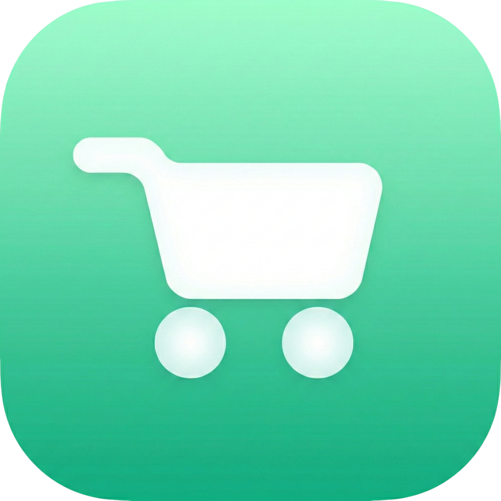
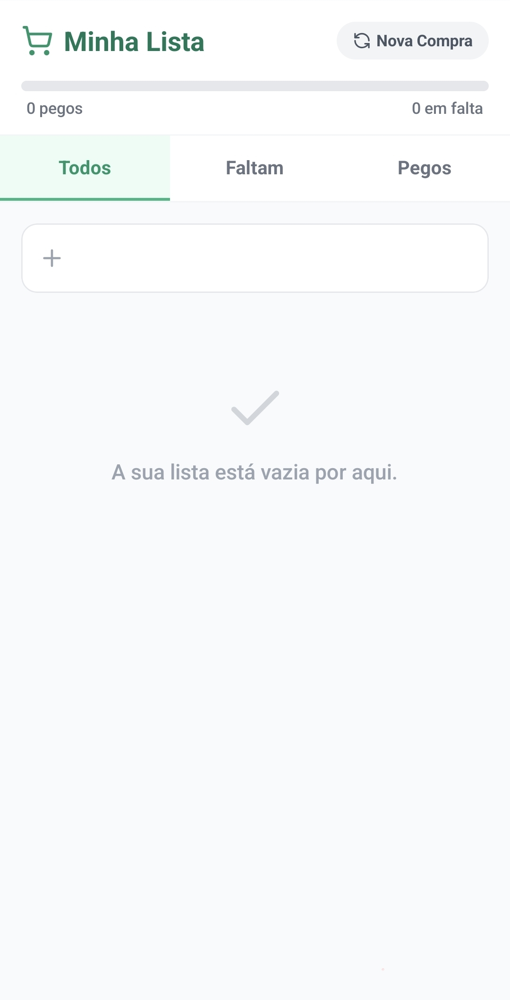
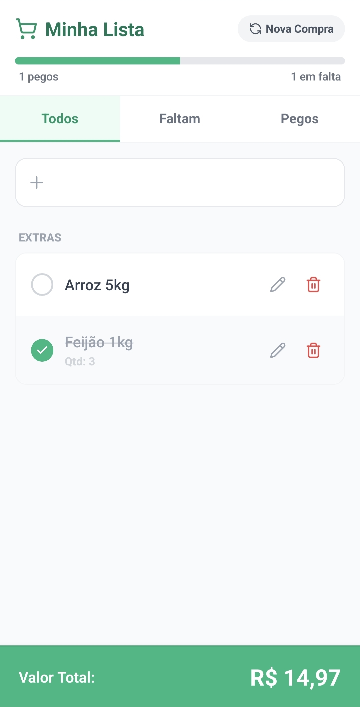
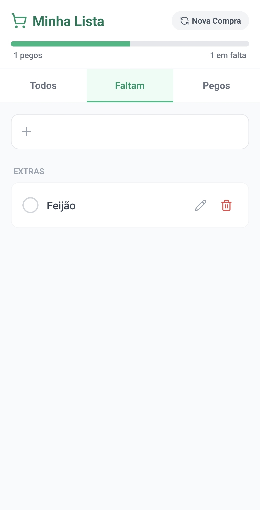
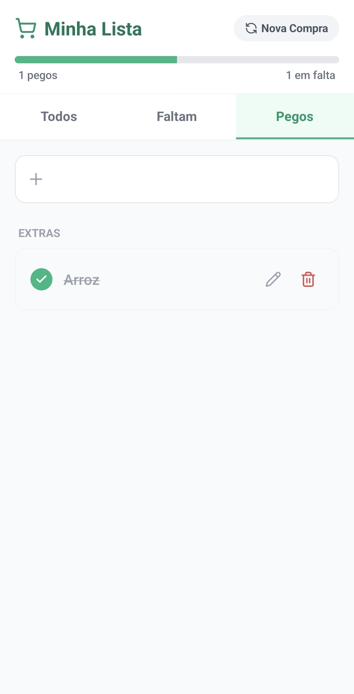

# Minhas Compras (mobile)

 <!-- Substitua por uma imagem real se disponível -->

Link para download(Android): <a href="https://drive.google.com/file/d/1tANOBvUNuNkDdAh4QFWbW_t2xD1_QsYQ/view?usp=sharing">minha-lista.apk</a>

## Descrição

Este é o meu primeiro aplicativo mobile desenvolvido do zero! [Minhas Compras](https://drive.google.com/file/d/1tANOBvUNuNkDdAh4QFWbW_t2xD1_QsYQ/view?usp=sharing) é um app simples e prático para gerenciar suas compras no supermercado. Evite esquecer itens, organize sua lista e edite detalhes com facilidade. Desenvolvido com foco em usabilidade, código limpo e boas práticas de desenvolvimento.

O app permite adicionar, editar e marcar itens como comprados, com uma interface moderna e responsiva. Ideal para uso diário no Android (e iOS via Expo).

## Funcionalidades

- **Adicionar Itens**: Insira novos itens rapidamente com nome, quantidade e preço.
- **Editar Itens**: Modal dedicado para alterar nome, quantidade ou preço de qualquer item.
- **Marcar como Comprado**: Clique para marcar itens com animação suave.
- **Gerenciamento de Estado**: Hook customizado `useShoppingList` para lidar com a lógica da lista, incluindo persistência via AsyncStorage.
- **Componentes Reutilizáveis**: Item da lista renderizado com `ShoppingListItem` para consistência.
- **Cálculo Automático**: Com preferência de adicionar um valor, assim que os itens são selecionados, os valores vão sendo somados automaticamente.
- **Ícones Modernos**: Integrado com Lucide Icons para uma UI atraente.

## Tecnologias Utilizadas

- **React Native**: Framework principal para desenvolvimento mobile cross-platform.
- **Expo**: Ferramenta para build, deploy e gerenciamento do app.
- **TypeScript**: Para tipagem estática e código mais seguro.
- **AsyncStorage**: Persistência de dados local.
- **Lucide React Native**: Biblioteca de ícones SVG.
- **React Native Safe Area Context**: Suporte a notches e barras de status.
- **Outras Dependências**: Expo Status Bar, React Native SVG.

## Instalação

1. Clone o repositório:
    ```
    git clone https://github.com/hrvieira/lista-de-compras-mobile.git
    ```
2. Navegue até o diretório do projeto:

    ```
    cd lista-de-compras-mobile
    ```

3. Instale as dependências:

    ```
    npm install
    ```

    ou

    ```
    yarn install
    ```

4. Inicie o app:

    ```
    npx expo start
    ```

    - Escolha `a` para Android ou `i` para iOS (emulador necessário).
    - Para build APK: `eas build --platform android` (requer conta Expo).

## Uso

- Abra o app no seu dispositivo ou emulador.
- Adicione itens usando o botão de adicionar.
- Toque em um item para editar via modal.
- Marque itens como comprados para riscá-los da lista.
- Os dados são salvos localmente, então a lista persiste entre sessões.

### Exemplos de Telas

1. **Tela Principal (HomeScreen)**: Lista os itens com opções de adicionar e editar.



2. **Tela Principal (HomeScreen)**: Lista os itens com opção de valores e soma dos mesmos.



3. **Tela de itens faltantes**: Lista apenas os itens que ainda não foram marcados.



4. **Tela de itens selecionados**: Lista apenas os itens que foram selecinados(pegos).



## Estrutura do Projeto

- **`src/components/`**: Componentes reutilizáveis como `ShoppingListItem` e `EditItemModal`.
- **`src/hooks/`**: Hooks customizados, como `useShoppingList` para gerenciar a lista.
- **`src/screens/`**: Telas do app, incluindo `HomeScreen`.
- **`src/types/`**: Definições de tipos TypeScript.
- **`assets/`**: Imagens, ícones e splash screen.
- **`App.tsx`**: Ponto de entrada do aplicativo.
- **`app.json`**: Configurações Expo.

## Contribuição

Contribuições são bem-vindas! Sinta-se à vontade para abrir issues ou pull requests. Para contribuir:

1. Fork o repositório.
2. Crie uma branch: `git checkout -b feature/nova-funcionalidade`.
3. Commit suas mudanças: `git commit -m 'Adiciona nova funcionalidade'`.
4. Push para a branch: `git push origin feature/nova-funcionalidade`.
5. Abra um Pull Request.

## Licença

Este projeto está licenciado sob a [MIT License](LICENSE). <!-- Adicione um arquivo LICENSE se não existir -->

## Contato

- **Autor**: Henrique Vieira
- **LinkedIn**: [luizhrvieira](https://www.linkedin.com/in/luizhrvieira)
- **GitHub**: [hrvieira](https://github.com/hrvieira)

Se você testou o app e gostou, dê uma estrela no repositório! Feedback é sempre apreciado. 🚀
